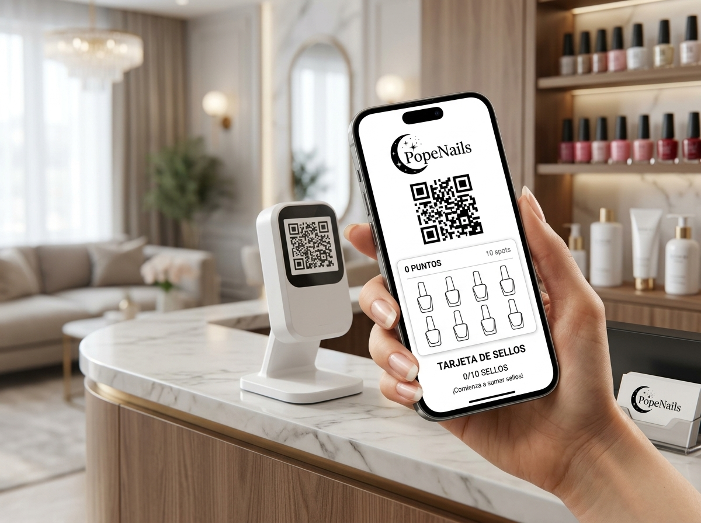

# 💅 PopeNails - Tarjeta Digital de Fidelización

Sistema de tarjeta de fidelización digital interactiva (PWA) para **PopeNails Studio**, optimizado para móviles y escáner de mostrador.



## ✨ Características

- **Diseño Oficial PopeNails**: Tema blanco luminoso, paleta oficial (`#FFF7F5`, `#C97B8A`, `#4A2535`), logotipo con luna y estrellas y tipografías *Playfair Display* & *Nunito*.
- **PWA Instalable**: Añadible a la pantalla de inicio en iOS y Android sin pasar por App Store.
- **Grilla de 10 Sellos**: Frasquitos de esmalte de uñas vectoriales que se llenan con animación líquida al escanear.
- **Gamificación**: Contador de puntos dinámico, feedback de premio y explosión de confeti al completar los 10 sellos.
- **Código QR Dinámico**: Para escaneo rápido en la recepción del salón.
- **Backend Integrado**: API REST en FastAPI (`/api/card`, `/api/scan`) compatible con Vercel Serverless.

## 🚀 Despliegue en Vercel

Este proyecto está preconfigurado para desplegarse automáticamente en **Vercel**:
1. Conecta este repositorio en [Vercel](https://vercel.com).
2. Despliega con la configuración predeterminada.

## 💻 Ejecución Local

```bash
# Iniciar servidor y frontend local
./run.sh
```
Abre en tu navegador `http://localhost:8000`.
